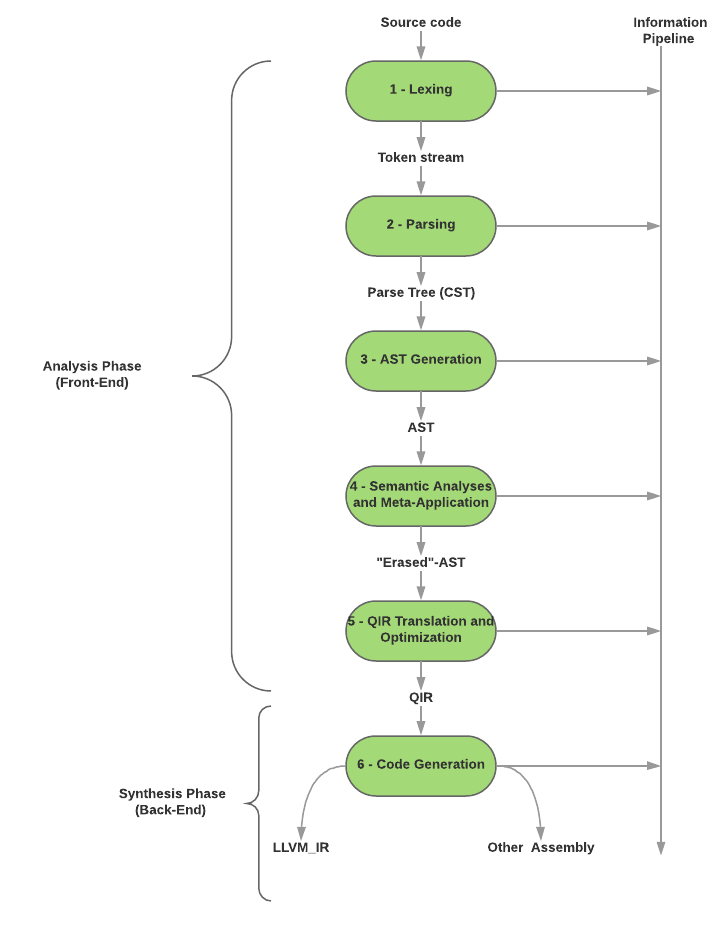

# Compiler phases

The compiler will be composed of 6 major phases in the pipeline of work:

1. Lexing
2. Parsing
3. AST Generation
4. Semantic Analyses and Meta-Application
5. QIR Translation and Optimization
6. Code Generation

Each phase yields a structure with extended informations related to the step we are in.

The structure is in fact decomposed in ***2 pipelines***.

The **main** pipeline which will apply the 6 different phases in a sequential like fashion.

We also have a **secondary** pipeline, called the ***Information pipeline*** used for gathering information regarding the phases, without having to keep them during the whole main process (which might allow better performance and better support for future tooling).

## Lexing

## Parsing

## AST Generation

## Semantic Analyses and Meta-Application

## QIR Translation and Optimization

## Code Generation
